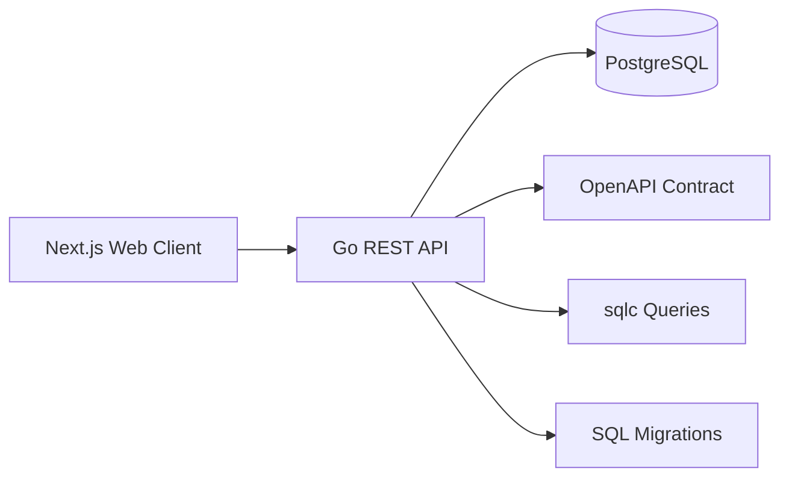

# Implementation Plan: User Registration and Login

**Branch**: `001-user-registration-login` | **Date**: 2026-07-13 | **Spec**: [spec.md](./spec.md)

**Input**: Feature specification from `/specs/001-user-registration-login/spec.md`

**Note**: This plan captures the implementation strategy for the first authentication vertical slice of ArthaKosha.

## Summary

Implement a modular authentication MVP with a Go REST API that exposes registration, login, and logout endpoints, backed by PostgreSQL and built with OpenAPI-first contract definitions, sqlc query generation, and versioned SQL migrations. The web client will be a Next.js + TypeScript application that provides the landing page, registration form, login form, authenticated home view, and logout flow. The initial scope is intentionally narrow: register → login → logout, with no financial domain features yet.

## Architecture Diagram



## Technical Context

**Language/Version**: Go 1.26+, TypeScript with Next.js, Node.js runtime for the web app, Docker Desktop for local orchestration

**Primary Dependencies**: Go REST server, `chi` or `net/http` routing, `pgx`, `sqlc`, `golang-migrate` or equivalent migration runner, Argon2id password hashing, Next.js TypeScript frontend, Docker Compose

**Storage**: PostgreSQL with one primary `users` table and a session state table for the auth MVP

**Testing**: Go unit/integration tests, API contract tests, frontend/component checks, and Docker-based local validation scenarios

**Target Platform**: Local development on Docker Desktop; deployable as a modular monolith composed of `apps/finance-api` and `apps/web`

**Project Type**: Web service + web application

**Performance Goals**: Local registration/login flow should complete within a contained p95 threshold on development hardware, with no measurable feature-specific performance targets beyond responsive local UX

**Constraints**: Authentication must stay session-based for the MVP, passwords must never be stored in plaintext, and no financial features may be introduced in this slice

**Scale/Scope**: One vertical slice covering account creation, authentication, and session termination only

## Constitution Check

*GATE: Must pass before Phase 0 research. Re-check after Phase 1 design.*

- **Specification First**: PASS — the approved feature specification is the source of truth for the MVP.
- **Test-Driven Development**: PASS — the implementation will be driven by contract and integration test coverage before the production path is completed.
- **OpenAPI-First Development**: PASS — the auth contract will be defined in OpenAPI before implementation begins.
- **Database-First Design**: PASS — the user and session model will be driven by a versioned migration and `sqlc` query definitions.
- **ACID Transactions**: PASS — registration and session changes will be committed within PostgreSQL transactional boundaries.
- **Financial Data Integrity**: PASS — no monetary data is introduced in this slice; only account and session metadata are managed.
- **Modular Monolith Architecture**: PASS — the solution remains a modular monolith split between backend and frontend app roots.
- **PostgreSQL Data Access**: PASS — access is limited to `pgx`, `sqlc`, and handwritten SQL.
- **Security & Authorization**: PASS — password hashing will use Argon2id or equivalent one-way hashing, and authorization will be session-bound to the authenticated user.
- **AI-Assisted Development**: PASS — generated code must remain aligned to the approved flow and repository structure.
- **Repository Organization**: PASS — the implementation will follow the constitution’s repository layout.

## Project Structure

### Documentation (this feature)

```text
specs/001-user-registration-login/
├── plan.md              # This file (/speckit.plan command output)
├── research.md          # Phase 0 output (/speckit.plan command)
├── data-model.md        # Phase 1 output (/speckit.plan command)
├── quickstart.md        # Phase 1 output (/speckit.plan command)
├── contracts/           # Phase 1 output (/speckit.plan command)
└── tasks.md             # Phase 2 output (/speckit.tasks command - NOT created by /speckit.plan)
```

### Source Code (repository root)

```text
apps/
├── finance-api/
│   ├── cmd/
│   ├── internal/
│   ├── migrations/
│   └── sql/
└── web/
    ├── app/
    ├── components/
    └── lib/

api/
└── openapi/
    └── authentication-v1.yaml

infra/
└── docker-compose.yml
```

**Structure Decision**: The repository will use the constitution-defined layout with a Go modular backend under `apps/finance-api`, a Next.js TypeScript client under `apps/web`, API contracts under `api/openapi`, and local infrastructure under `infra/`. The backend will separate domain modules from shared infrastructure and will store migrations in a dedicated `migrations` directory plus `sqlc` query definitions in a dedicated `sql` directory.

## Complexity Tracking

> **Fill ONLY if Constitution Check has violations that must be justified**

No constitution violations were identified for this MVP. No complexity exceptions are required.
