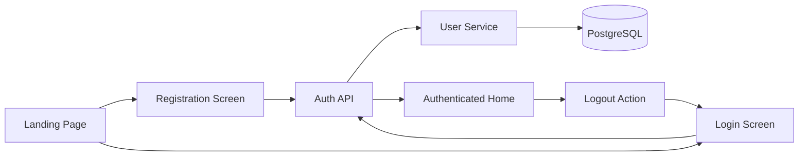
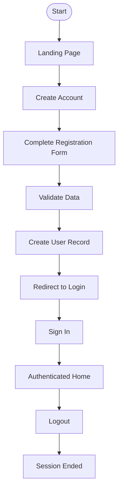
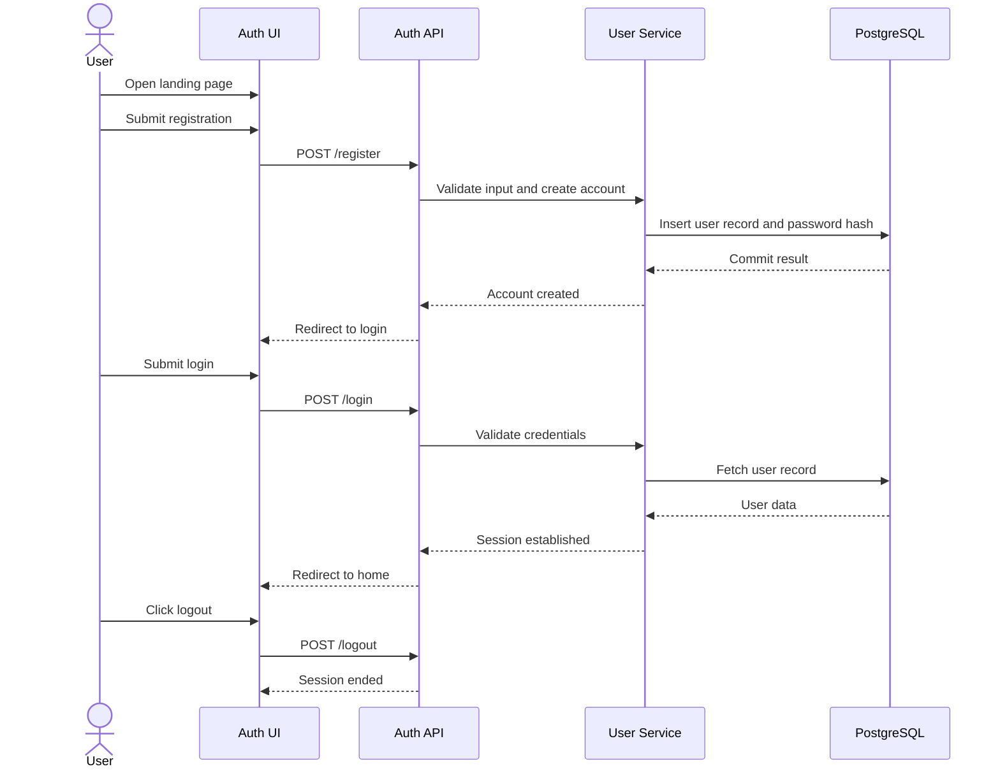

# Feature Specification: User Registration and Login

**Feature Branch**: `001-user-registration-login`

**Created**: 2026-07-13

**Status**: Draft

**Input**: User description: "User Registration and Login"

## User Scenarios & Testing *(mandatory)*

### User Story 1 - Register a New Account (Priority: P1)

A new person can open ArthaKosha, create an account with their personal details, and complete onboarding without exposing their password in plaintext.

**Why this priority**: Account creation is the entry point to every future finance workflow and must succeed reliably before access to private financial data is granted.

**Independent Test**: A user can open the app, submit a complete registration form with unique values, and complete onboarding with a successful confirmation outcome.

**Acceptance Scenarios**:

1. **Given** a user has not created an account, **When** they submit a valid registration form with unique username, email, and mobile number, **Then** the system creates the account and redirects the user to the login experience.
2. **Given** a user submits a username, email, or mobile number that is already in use, **When** the submission is validated, **Then** the system rejects the registration and shows a clear duplicate-data message.
3. **Given** a user submits data that fails validation, **When** the form is checked, **Then** the system blocks submission and highlights the specific invalid fields.

---

### User Story 2 - Log In and Reach the Logged-In Home State (Priority: P1)

An existing user can sign in with their username and password and reach a simple authenticated home state that acknowledges them by first name.

**Why this priority**: Login is the primary mechanism for protected access to the application’s first authenticated vertical slice and must preserve expected security and privacy behavior.

**Independent Test**: A user can enter valid credentials, receive an authenticated session, and see the logged-in home state with an identifying welcome message.

**Acceptance Scenarios**:

1. **Given** a registered user with valid credentials, **When** they submit a login request, **Then** the system authenticates the user and presents the logged-in home state.
2. **Given** a user enters an incorrect username or password, **When** the login request is submitted, **Then** the system returns a generic authentication error and does not reveal whether the username or password was wrong.
3. **Given** an unauthenticated user attempts to access a protected page, **When** the request is evaluated, **Then** the system denies access and redirects the user to the sign-in flow.

---

### Edge Cases

- What happens when a user submits mismatched confirm-password data?
- How does the system handle a date of birth that is in the future or a password that does not meet the minimum complexity rule?
- What happens if the registration attempt fails midway after validation so that no partial account state is persisted?
- What happens if a user tries to log in with a valid username but an incorrect password more than once in succession?

## Authentication Design Note *(mandatory)*

During the MVP and early development, ArthaKosha MAY use a built-in local authentication provider based on username and password. The authentication behavior MUST be abstracted behind a dedicated authentication module so that it can later be replaced or extended with an OpenID Connect provider without affecting business logic.

Production deployments are expected to use OpenID Connect, with Keycloak as the preferred identity provider.

## UI Mockups *(mandatory)*

The following wireframes are part of the requirements and MUST be reviewed as part of the approval process. They define the intended MVP scope strictly as an authentication flow: landing page → register → registration success → login → logged in home → logout. No financial dashboard, budgets, reports, or account-management functionality is included in this feature.

### 1. Landing Page Wireframe

```text
+--------------------------------------------------------------+
|                          ArthaKosha                          |
|              Personal & Family Finance Manager               |
+--------------------------------------------------------------+

            Welcome to ArthaKosha

            Manage your personal finances securely.

              +-------------------------+
              |     Create Account      |
              +-------------------------+

              +-------------------------+
              |         Login           |
              +-------------------------+

                 Version 0.1.0
```

### 2. Registration Wireframe

```text
+--------------------------------------------------------------+
| ArthaKosha                                   Create Account  |
+--------------------------------------------------------------+

 Full Name

 +----------------------------------------------------------+

 Date of Birth

 +----------------------+

 Mobile Number

 +----------------------------------------------------------+

 Email

 +----------------------------------------------------------+

 Username

 +----------------------------------------------------------+

 Password

 +----------------------------------------------------------+

 Confirm Password

 +----------------------------------------------------------+

                 +---------------------------+
                 |      Create Account       |
                 +---------------------------+

 Already have an account?

                     [ Login ]
```

### 3. Registration Success Wireframe

```text
+--------------------------------------------------------------+
|                      Registration Successful                 |
+--------------------------------------------------------------+

 Welcome to ArthaKosha!

 Your account has been created successfully.

 Username : [user chosen username]

                +-----------------------+
                |     Proceed to Login  |
                +-----------------------+
```

### 4. Login Wireframe

```text
+--------------------------------------------------------------+
| ArthaKosha                                           Login   |
+--------------------------------------------------------------+

 Username

 +----------------------------------------------------------+

 Password

 +----------------------------------------------------------+

                 +---------------------------+
                 |          Login            |
                 +---------------------------+

 Don't have an account?

                 [ Create Account ]
```

### 5. Logged In (Home) Wireframe

```text
+--------------------------------------------------------------+
| ArthaKosha                                        Home       |
+--------------------------------------------------------------+

 Welcome, [user first name]!

 You are successfully logged in.

 User ID : [generated user ID]

 Status  : Logged In

 ------------------------------------------------------------

                 +---------------------------+
                 |          Logout           |
                 +---------------------------+
```

### 6. After Logout Wireframe

```text
+--------------------------------------------------------------+
|                     Session Ended                            |
+--------------------------------------------------------------+

 You have been logged out successfully.

                +-----------------------+
                |         Login         |
                +-----------------------+
```

**Intent**: This feature demonstrates the complete authentication lifecycle only: register → login → logout and login → logout. The UI is intentionally minimal and limited to the first vertical slice of the application.

## System Design & Flow Documentation *(mandatory)*

### Architecture Diagram



### User Flow Diagram



### Call Flow Diagram



### Documentation Finalization Rule

- The final architecture and supporting design notes MUST be written to the `docs/` directory only after the feature implementation has stabilized.
- The feature specification MUST show the exact user flow and call flow for the feature using Mermaid diagrams, not just prose describing the intent.

## Requirements *(mandatory)*

### Functional Requirements

- **FR-001**: The system MUST allow a new user to create an account using full name, date of birth, mobile number, email address, username, password, and confirm password.
- **FR-002**: The system MUST validate every required field before the account is created.
- **FR-003**: The system MUST reject duplicate usernames, duplicate email addresses, and duplicate mobile numbers when those values are required to be unique.
- **FR-004**: The system MUST enforce the username format rule of 4–30 characters using letters, numbers, underscores, and periods only.
- **FR-005**: The system MUST enforce a minimum password strength policy of at least 12 characters, containing at least one uppercase letter, one lowercase letter, one digit, and one special character.
- **FR-006**: The system MUST reject invalid email formats and dates of birth that are in the future.
- **FR-007**: The system MUST ensure that confirm password matches password before account creation is accepted.
- **FR-008**: The system MUST generate a unique user identifier automatically for every new account.
- **FR-009**: The system MUST store the password only as a secure one-way hash using Argon2id and MUST never store it in plaintext.
- **FR-010**: The system MUST persist the user record atomically within a single transaction so that registration cannot leave partial records behind.
- **FR-011**: The system MUST allow an existing user to sign in using username and password.
- **FR-012**: The system MUST return a generic authentication error when provided credentials are invalid.
- **FR-013**: The system MUST establish an authenticated session for a successfully signed-in user and present the logged-in home state.
- **FR-014**: The system MUST show a personalized welcome message using the user’s first name.
- **FR-015**: The system MUST permit the user to log out from the logged-in home state and return to a signed-out session-ended state.
- **FR-016**: The system MUST prevent unauthenticated users from accessing protected pages.
- **FR-017**: The system MUST maintain a clear onboarding and sign-in experience with single-column entry, inline validation feedback, and accessible error messaging.
- **FR-018**: The authentication implementation MUST be encapsulated in a dedicated authentication module so that the current local provider can be swapped for OpenID Connect or other providers without changing business logic.
- **FR-019**: Authentication cookies or session transport MUST use HttpOnly and Secure attributes whenever HTTPS is enabled.

### Key Entities *(include if feature involves data)*

- **User**: Represents a person who can register, authenticate, and access personalized finance features. Key attributes include full name, date of birth, mobile number, email address, username, password hash, user ID, created timestamp, and updated timestamp.
- **Authenticated Session**: Represents a successful sign-in state that is established only after validating the user’s credentials and that grants access to protected pages.

## Success Criteria *(mandatory)*

### Measurable Outcomes

- **SC-001**: Registration requests must complete successfully within 2 seconds for the local development environment under the defined benchmark scenario.
- **SC-002**: Login requests must complete successfully within 1 second for the local development environment under the defined benchmark scenario.
- **SC-003**: 100% of stored passwords are stored only as one-way hashes rather than plaintext.
- **SC-004**: 100% of valid registration attempts succeed when the request is complete and unique, with no partial account state persisted.
- **SC-005**: Protected pages are inaccessible to unauthenticated users, and authenticated users are greeted by their first name in the logged-in home state.
- **SC-006**: 100% of authentication-related files must maintain at least 90% overall coverage, with 100% coverage required for each file unless an explicit justified exception is documented.

## Assumptions

- The first product release will use a simple, secure session-based sign-in flow rather than a token-only authentication model.
- A successful registration will redirect the user to the login experience, preserving an explicit sign-in boundary after account creation.
- Mobile number is treated as a required and unique field for the MVP because the requested flow indicates it should be collected and verified as unique.
- Account creation, login, and logout are treated as the primary use cases for the MVP, while broader account recovery, MFA, and profile management are out of scope for this feature.
