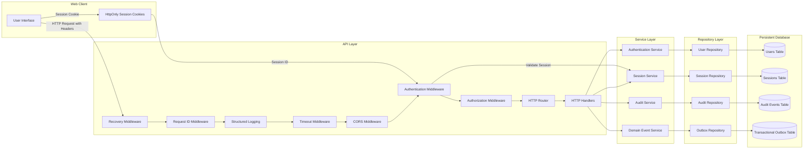
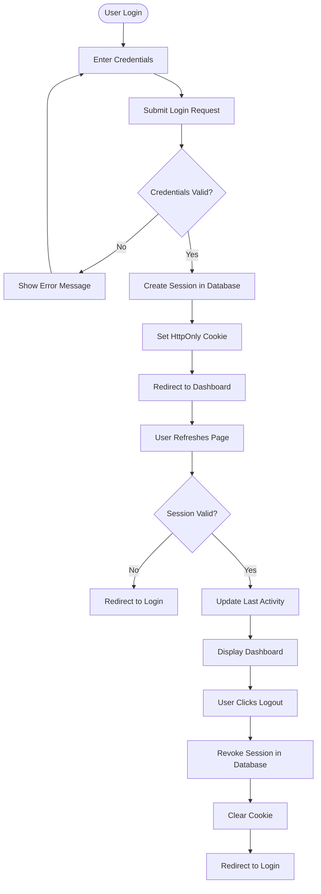
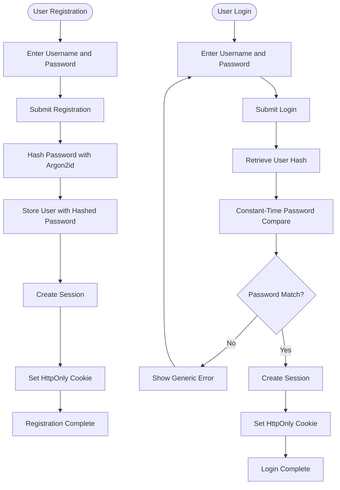
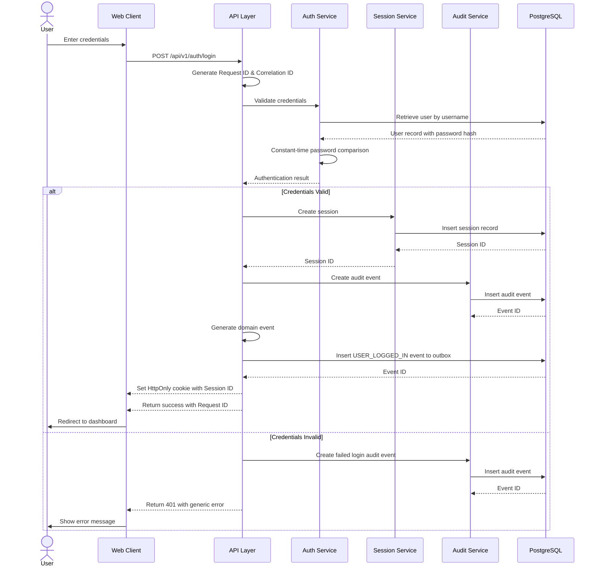
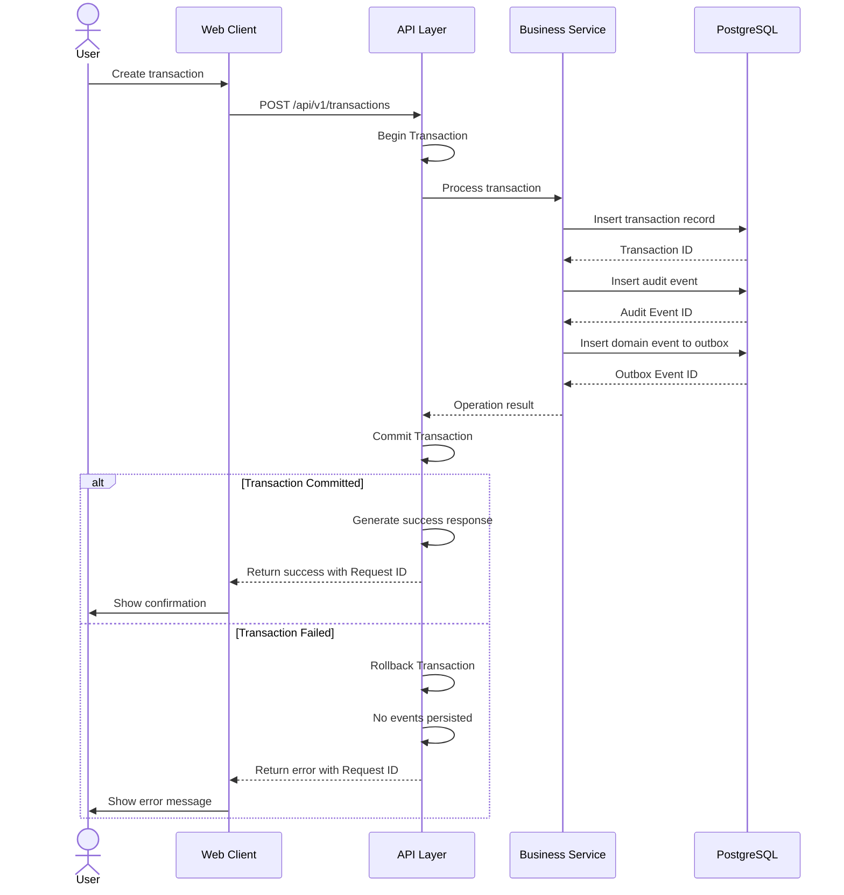

# Feature Specification: Infrastructure Modernization and Observability

**Feature Branch**: `[002-infra-observability-sessions]`

**Created**: 2026-07-14

**Status**: Draft

**Input**: User description: "Updates to existing infra, observability, session handling"

## User Scenarios & Testing *(mandatory)*

### User Story 1 - Robust Session Management (Priority: P1)

As a user, I need my login sessions to be managed securely and reliably, so that I can remain authenticated across browser sessions and can log out from all devices when needed.

**Why this priority**: Session management is fundamental to the user experience and security. Without reliable sessions, users cannot effectively use the application, and security vulnerabilities could expose user data.

**Independent Test**: Users can log in, refresh the page, and remain authenticated. Users can explicitly log out and be fully signed out. System can handle multiple concurrent sessions from different devices.

**Acceptance Scenarios**:

1. **Given** a user is logged in, **When** they refresh the page, **Then** they remain authenticated without having to log in again
2. **Given** a user is logged in on multiple devices, **When** they log out from one device, **Then** they are logged out from that device but remain logged in on other devices
3. **Given** a user's session has expired, **When** they attempt to access a protected resource, **Then** they are redirected to the login page
4. **Given** a user is logged in, **When** they explicitly click logout, **Then** their session is immediately terminated and they cannot access protected resources

---

### User Story 2 - Secure Authentication (Priority: P1)

As a user, I need my password to be stored and verified using industry-standard security practices, so that my account remains protected even if the database is compromised.

**Why this priority**: Security is foundational to a financial application. Weak password hashing could lead to catastrophic security breaches and loss of user trust.

**Independent Test**: Users can register and log in with strong passwords. The system prevents common attack vectors against password storage.

**Acceptance Scenarios**:

1. **Given** a user registers with a password, **When** the password is stored, **Then** it is hashed using a secure algorithm (Argon2id) with proper salting
2. **Given** a user logs in with correct credentials, **When** they submit their password, **Then** they are successfully authenticated
3. **Given** a user logs in with incorrect credentials, **When** they submit their password, **Then** authentication fails without revealing whether the username or password was incorrect
4. **Given** a user changes their password, **When** the change is processed, **Then** the old password hash is invalidated and the new password is securely hashed

---

### User Story 3 - Reliable API Operations (Priority: P1)

As a user, I need all API operations to complete reliably and consistently, so that my financial data is never left in an inconsistent state due to system failures.

**Why this priority**: Financial data integrity is critical. Partial updates or inconsistent data could lead to incorrect financial records and user distrust.

**Independent Test**: Users can perform financial operations (create accounts, record transactions) and be confident that either the entire operation succeeds or fails atomically. System can recover from failures without data corruption.

**Acceptance Scenarios**:

1. **Given** a user creates a new account, **When** the creation process starts, **Then** the account is either fully created with all required data or not created at all
2. **Given** a user records a transaction, **When** the database operation fails partway through, **Then** no partial data is persisted and the user receives a clear error message
3. **Given** a user performs multiple related operations, **When** any operation fails, **Then** all related operations are rolled back to maintain consistency
4. **Given** the system experiences a temporary failure, **When** it recovers, **Then** all data remains consistent and no operations are partially applied

---

### User Story 4 - Comprehensive System Observability (Priority: P2)

As a system administrator, I need comprehensive logging and observability, so that I can quickly diagnose issues, track system health, and ensure security incidents are properly recorded.

**Why this priority**: Observability is essential for operating a production system. Without proper logging and monitoring, issues cannot be diagnosed efficiently, and security incidents cannot be properly investigated.

**Independent Test**: System administrators can access structured logs that contain all relevant context (request IDs, user IDs, timestamps). Audit events are recorded for all significant operations. Issues can be traced through log correlation.

**Acceptance Scenarios**:

1. **Given** a user performs any significant operation, **When** the operation completes, **Then** an audit event is recorded with all relevant context (user, action, resource, timestamp)
2. **Given** an error occurs in the system, **When** the error is logged, **Then** the log entry contains request ID, correlation ID, user ID, and detailed error information
3. **Given** a user makes an API request, **When** the request is processed, **Then** all log entries for that request share the same correlation ID for easy tracing
4. **Given** a security incident occurs, **When** investigators review the logs, **Then** they can trace the complete sequence of events with full context

---

### User Story 5 - Cross-Origin Resource Sharing (Priority: P2)

As a frontend developer, I need proper CORS configuration, so that the web application can communicate with the API without browser security restrictions.

**Why this priority**: CORS misconfiguration prevents the frontend from communicating with the backend, breaking the entire application. Proper CORS is essential for the web client to function.

**Independent Test**: The web application can successfully make API requests from the configured frontend domain. Preflight requests are handled correctly without 405 errors.

**Acceptance Scenarios**:

1. **Given** the web application is running on the configured domain, **When** it makes an API request, **Then** the request succeeds without CORS errors
2. **Given** the web application makes a preflight OPTIONS request, **When** the server responds, **Then** the response has appropriate CORS headers and a 200 status code
3. **Given** an unauthorized domain attempts to make API requests, **When** the request is made, **Then** it is rejected by CORS policy
4. **Given** the application is deployed to production, **When** the frontend domain changes, **Then** CORS configuration can be updated without code changes

---

### User Story 6 - Event-Based System Integration (Priority: P3)

As a system architect, I need domain events to be reliably captured and stored, so that future features (reporting, notifications, forecasting) can consume them without modifying core business logic.

**Why this priority**: While not immediately user-visible, event-based architecture enables future features and integrations. Implementing it now prevents architectural debt and makes future enhancements easier.

**Independent Test**: Domain events are generated for all state-changing operations and stored reliably in the outbox. Events can be consumed by future consumers without affecting core business logic.

**Acceptance Scenarios**:

1. **Given** a user performs a state-changing operation (e.g., creates a transaction), **When** the operation completes, **Then** a corresponding domain event is written to the outbox within the same transaction
2. **Given** the system generates a domain event, **When** the transaction commits, **Then** the event is guaranteed to be persisted
3. **Given** a transaction fails and rolls back, **When** the rollback occurs, **Then** no domain event is persisted for the failed operation
4. **Given** events are stored in the outbox, **When** a future consumer processes them, **Then** events are processed exactly once in order

---

### Edge Cases

- What happens when a user's session expires while they are actively using the application?
- How does the system handle database connection failures during authentication?
- What happens when a user attempts to log in from a new device while already at the session limit?
- How does the system handle concurrent login attempts from the same user?
- What happens when the audit event storage becomes unavailable?
- How does the system handle malformed or malicious CORS requests?
- What happens when domain event processing fails after the transaction has committed?
- How does the system handle password hash verification timing attacks?

## Requirements *(mandatory)*

### Functional Requirements

#### Session Management
- **FR-001**: System MUST store user sessions in a persistent database with session ID, user ID, creation timestamp, last activity timestamp, expiration timestamp, revocation timestamp, user agent, and optional IP address
- **FR-002**: System MUST support multiple concurrent active sessions per user
- **FR-003**: System MUST validate session status on every authenticated request
- **FR-004**: System MUST automatically expire sessions after a configurable period of inactivity
- **FR-005**: System MUST allow users to explicitly logout and revoke their current session
- **FR-006**: System MUST allow users to revoke all their sessions across all devices
- **FR-007**: System MUST use secure HttpOnly cookies for web client session management
- **FR-008**: System MUST NOT store authentication state in browser localStorage

#### Authentication Security
- **FR-009**: System MUST hash user passwords using a modern, memory-hard hashing algorithm with secure random salts
- **FR-010**: System MUST use constant-time comparison for password verification to prevent timing attacks
- **FR-011**: System MUST NOT use fast hashing algorithms vulnerable to brute force attacks for password storage
- **FR-012**: System MUST keep authentication behind an abstraction layer to support future migration to external identity providers
- **FR-013**: System MUST invalidate old password hashes when users change their passwords

#### Data Consistency
- **FR-014**: System MUST execute all related write operations within ACID transactions
- **FR-015**: System MUST rollback entire transaction when any operation within it fails
- **FR-016**: System MUST prevent partial updates that could leave data in inconsistent state
- **FR-017**: System MUST use transactions for user registration, login session creation, account creation, expense recording, income recording, transfers, budget creation, audit event creation, and transactional outbox creation
- **FR-018**: System MUST allow explicit corrections that are auditable and never leave inconsistent data

#### Observability and Logging
- **FR-019**: System MUST use structured logging with consistent log levels and formats
- **FR-020**: System MUST include timestamp, log level, service, component, module, operation, request ID, correlation ID, user ID, session ID, duration, and message in every log entry
- **FR-021**: System MUST assign a unique request ID to every incoming request
- **FR-022**: System MUST assign a correlation ID to every request and propagate it through all operations
- **FR-023**: System MUST return request ID in API responses where appropriate
- **FR-024**: System MUST NEVER log passwords, tokens, secrets, hashes, or vault values
- **FR-025**: System MUST write all log entries to standard output/error streams for platform-managed rotation

#### Audit Events
- **FR-026**: System MUST generate an immutable audit event for every successful business operation
- **FR-027**: System MUST store audit events in a persistent database with event ID, request ID, user ID, session ID, resource, resource ID, action, result, timestamp, user agent, and client IP
- **FR-028**: System MUST ensure audit records are append-only and never modified
- **FR-029**: System MUST generate audit events for user registration, login, logout, account creation, transaction creation, budget creation, and any data modifications

#### Domain Events
- **FR-030**: System MUST generate a domain event for every state-changing business operation
- **FR-031**: System MUST write domain events to a transactional outbox within the same database transaction as the business operation
- **FR-032**: System MUST ensure domain events are written atomically with the business operation
- **FR-033**: System MUST support domain events for USER_REGISTERED, USER_LOGGED_IN, USER_LOGGED_OUT, ACCOUNT_CREATED, TRANSACTION_CREATED, and BUDGET_CREATED

#### HTTP Routing and CORS
- **FR-034**: System MUST use a capable HTTP router that supports middleware chains and proper request handling
- **FR-035**: System MUST use standard CORS middleware for cross-origin request handling
- **FR-036**: System MUST respond to OPTIONS preflight requests with appropriate CORS headers and never return 405 status
- **FR-037**: System MUST support configurable CORS origins through application configuration
- **FR-038**: System MUST allow GET, POST, PUT, PATCH, DELETE, and OPTIONS methods
- **FR-039**: System MUST allow Content-Type, Authorization, X-Request-ID, X-Correlation-ID, and X-Session-ID headers
- **FR-040**: System MUST expose X-Request-ID and X-Correlation-ID headers in responses
- **FR-041**: System MUST support credentials in CORS requests
- **FR-042**: System MUST apply middleware in order: Recovery, Request ID, Structured Logging, Timeout, CORS, Authentication, Authorization, Router

#### Repository Layer
- **FR-043**: System MUST implement database repositories using type-safe SQL query generation
- **FR-044**: System MUST NOT use in-memory repositories for production data access
- **FR-045**: System MUST execute repository tests against a database running in containerized infrastructure
- **FR-046**: System MUST provide complete repository implementations without placeholder code

### Key Entities

- **Session**: Represents a user authentication session with session ID, user ID, creation timestamp, last activity timestamp, expiration timestamp, revocation timestamp, user agent, IP address, and session status
- **Audit Event**: Represents an immutable record of a business operation with event ID, request ID, user ID, session ID, resource, resource ID, action, result, timestamp, user agent, and client IP
- **Domain Event**: Represents a state change in the system with event type, aggregate ID, event data, timestamp, and processing status
- **Transactional Outbox**: Represents a reliable event delivery mechanism with event ID, event type, payload, creation timestamp, processing status, and retry count

## System Design & Flow Documentation *(mandatory)*

### Architecture Diagram

### User Flow Diagram - Session Management

### User Flow Diagram - Authentication Security

### Call Flow Diagram - Login with Session Management

### Call Flow Diagram - Transaction with Outbox Pattern

### Documentation Finalization Rule

- The final architecture and supporting design notes MUST be written to the `docs/` directory only after the feature implementation has stabilized.
- The feature specification MUST show the exact user flow and call flow for the feature using Mermaid diagrams, not just prose describing the intent.

## Success Criteria *(mandatory)*

### Measurable Outcomes

- **SC-001**: Users can successfully log in and maintain their session across page refreshes in under 2 seconds
- **SC-002**: System can handle 1,000 concurrent authenticated users without session validation errors
- **SC-003**: 100% of user password data is stored using Argon2id hashing with proper salting
- **SC-004**: 100% of financial operations complete atomically with no partial updates or data inconsistencies
- **SC-005**: 100% of significant business operations generate immutable audit events with complete context
- **SC-006**: 100% of API requests include request IDs and correlation IDs for traceability
- **SC-007**: 100% of preflight CORS requests return appropriate headers with 200 status code (no 405 errors)
- **SC-008**: 100% of state-changing operations generate domain events stored in the transactional outbox
- **SC-009**: All log entries contain required fields (timestamp, level, service, component, operation, request ID, correlation ID, user ID, session ID, duration, message)
- **SC-010**: Zero instances of sensitive data (passwords, tokens, secrets) appear in log files
- **SC-011**: System administrators can trace any user request end-to-end using correlation IDs in under 5 minutes
- **SC-012**: Security investigators can reconstruct complete user activity sequences from audit logs for any 24-hour period

## Assumptions

- PostgreSQL is already configured and accessible for the application
- The existing user registration and login functionality will be refactored to use the new session management system
- HashiCorp Vault is available for secret management (or will be configured as part of implementation)
- The web frontend is already configured to work with HttpOnly cookies
- Session expiration time defaults to 24 hours of inactivity unless otherwise configured
- Argon2id parameters (time cost, memory cost, parallelism) will be configured according to OWASP recommendations
- CORS configuration will initially support localhost:3000 for development and be configurable for production
- Domain event consumers will be implemented in future features; the outbox pattern ensures events are available when needed
- Repository tests will use a dedicated test database instance running in Docker Compose
- The existing authentication system architecture can be refactored to support the abstraction layer requirement without breaking existing functionality
