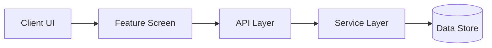
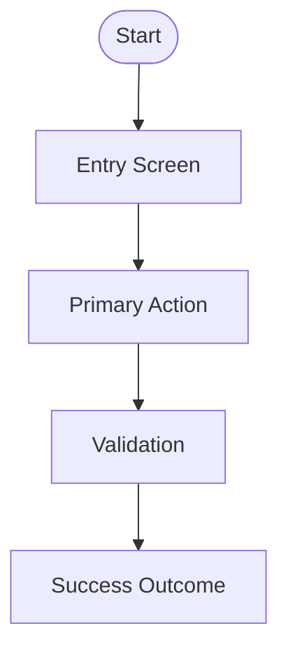
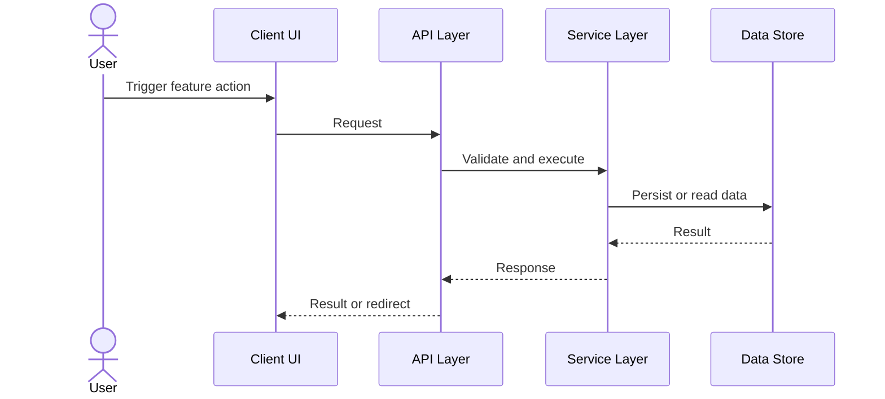

# Feature Specification: [FEATURE NAME]

**Feature Branch**: `[###-feature-name]`

**Created**: [DATE]

**Status**: Draft

**Input**: User description: "$ARGUMENTS"

## User Scenarios & Testing *(mandatory)*

<!--
  IMPORTANT: User stories should be PRIORITIZED as user journeys ordered by importance.
  Each user story/journey must be INDEPENDENTLY TESTABLE - meaning if you implement just ONE of them,
  you should still have a viable MVP (Minimum Viable Product) that delivers value.

  Assign priorities (P1, P2, P3, etc.) to each story, where P1 is the most critical.
  Think of each story as a standalone slice of functionality that can be:
  - Developed independently
  - Tested independently
  - Deployed independently
  - Demonstrated to users independently
-->

### User Story 1 - [Brief Title] (Priority: P1)

[Describe this user journey in plain language]

**Why this priority**: [Explain the value and why it has this priority level]

**Independent Test**: [Describe how this can be tested independently - e.g., "Can be fully tested by [specific action] and delivers [specific value]"]

**Acceptance Scenarios**:

1. **Given** [initial state], **When** [action], **Then** [expected outcome]
2. **Given** [initial state], **When** [action], **Then** [expected outcome]

---

### User Story 2 - [Brief Title] (Priority: P2)

[Describe this user journey in plain language]

**Why this priority**: [Explain the value and why it has this priority level]

**Independent Test**: [Describe how this can be tested independently]

**Acceptance Scenarios**:

1. **Given** [initial state], **When** [action], **Then** [expected outcome]

---

### User Story 3 - [Brief Title] (Priority: P3)

[Describe this user journey in plain language]

**Why this priority**: [Explain the value and why it has this priority level]

**Independent Test**: [Describe how this can be tested independently]

**Acceptance Scenarios**:

1. **Given** [initial state], **When** [action], **Then** [expected outcome]

---

[Add more user stories as needed, each with an assigned priority]

### Edge Cases

<!--
  ACTION REQUIRED: The content in this section represents placeholders.
  Fill them out with the right edge cases.
-->

- What happens when [boundary condition]?
- How does system handle [error scenario]?

## Requirements *(mandatory)*

<!--
  ACTION REQUIRED: The content in this section represents placeholders.
  Fill them out with the right functional requirements.
-->

### Functional Requirements

- **FR-001**: System MUST [specific capability, e.g., "allow users to create accounts"]
- **FR-002**: System MUST [specific capability, e.g., "validate email addresses"]
- **FR-003**: Users MUST be able to [key interaction, e.g., "reset their password"]
- **FR-004**: System MUST [data requirement, e.g., "persist user preferences"]
- **FR-005**: System MUST [behavior, e.g., "log all security events"]

*Example of marking unclear requirements:*

- **FR-006**: System MUST authenticate users via [NEEDS CLARIFICATION: auth method not specified - email/password, SSO, OAuth?]
- **FR-007**: System MUST retain user data for [NEEDS CLARIFICATION: retention period not specified]

### Session Management Requirements *(mandatory for authentication features)*

- **FR-XXX**: System MUST use HttpOnly cookies for web client session management
- **FR-XXX**: System MUST NOT store authentication state in browser localStorage
- **FR-XXX**: System MUST implement sliding session expiration with configurable timeout
- **FR-XXX**: System MUST validate session status on every authenticated request
- **FR-XXX**: System MUST support session revocation (single device and all devices)

### Observability and Audit Logging Requirements *(mandatory for all features)*

- **FR-XXX**: System MUST implement structured logging with consistent log levels and formats
- **FR-XXX**: System MUST include timestamp, level, service, component, operation, request ID, correlation ID, user ID, session ID, duration, and message in every log entry
- **FR-XXX**: System MUST assign unique request IDs and correlation IDs to every request
- **FR-XXX**: System MUST generate immutable audit events for every successful business operation
- **FR-XXX**: System MUST NEVER log passwords, tokens, secrets, hashes, or vault values

### Key Entities *(include if feature involves data)*

- **[Entity 1]**: [What it represents, key attributes without implementation]
- **[Entity 2]**: [What it represents, relationships to other entities]

## System Design & Flow Documentation *(mandatory)*

<!--
  ACTION REQUIRED: Document the architecture and exact flows that the feature depends on.
  These sections MUST be included in the approved feature specification.
  Mermaid diagrams are mandatory for the architecture, user flow, and call flow artifacts.
-->

### Architecture Diagram

### User Flow Diagram

### Call Flow Diagram

### Documentation Finalization Rule

- The final architecture and supporting design notes MUST be written to the `docs/` directory only after the feature implementation has stabilized.
- The feature specification MUST show the exact user flow and call flow for the feature using Mermaid diagrams, not just prose describing the intent.

## Success Criteria *(mandatory)*

<!--
  ACTION REQUIRED: Define measurable success criteria.
  These must be technology-agnostic and measurable.
-->

### Measurable Outcomes

- **SC-001**: [Measurable metric, e.g., "Users can complete account creation in under 2 minutes"]
- **SC-002**: [Measurable metric, e.g., "System handles 1000 concurrent users without degradation"]
- **SC-003**: [User satisfaction metric, e.g., "90% of users successfully complete primary task on first attempt"]
- **SC-004**: [Business metric, e.g., "Reduce support tickets related to [X] by 50%"]

## Assumptions

<!--
  ACTION REQUIRED: The content in this section represents placeholders.
  Fill them out with the right assumptions based on reasonable defaults
  chosen when the feature description did not specify certain details.
-->

- [Assumption about target users, e.g., "Users have stable internet connectivity"]
- [Assumption about scope boundaries, e.g., "Mobile support is out of scope for v1"]
- [Assumption about data/environment, e.g., "Existing authentication system will be reused"]
- [Dependency on existing system/service, e.g., "Requires access to the existing user profile API"]
