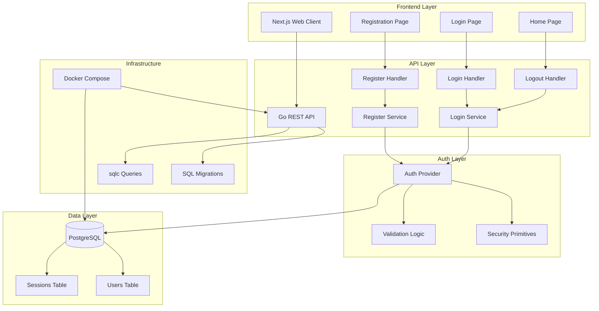
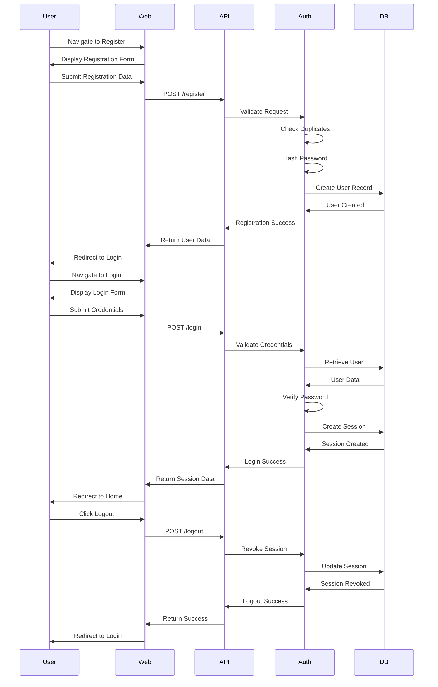
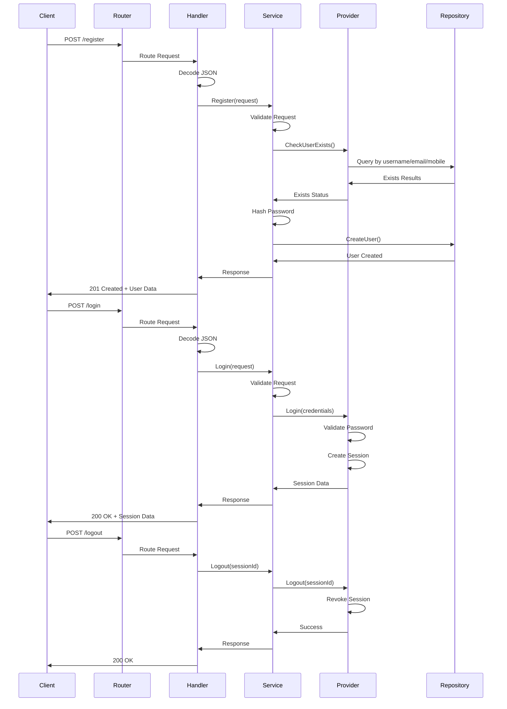

# Authentication MVP Architecture

**Feature**: User Registration and Login  
**Version**: 1.0.0  
**Date**: 2026-07-14  
**Status**: Implemented

## Overview

This document describes the architecture of the authentication MVP for ArthaKosha, implementing user registration, login, and logout functionality using a modular monolith architecture with a Go REST API and Next.js frontend.

## System Architecture



## User Flow



## API Call Flow



## Component Architecture

### Backend (Go)

```
apps/finance-api/
├── cmd/
│   └── main.go                 # Application entry point
├── internal/
│   ├── auth/
│   │   ├── provider.go         # Auth provider interface and implementation
│   │   ├── security.go         # Password hashing and validation
│   │   ├── register_service.go # Registration business logic
│   │   ├── login_service.go    # Login business logic
│   │   ├── contract/           # API contract tests
│   │   ├── integration/        # Integration tests
│   │   └── validation/         # Unit validation tests
│   ├── http/
│   │   ├── router.go           # HTTP routing
│   │   ├── register_handler.go # Registration HTTP handler
│   │   └── auth_handlers.go    # Login/logout HTTP handlers
│   ├── users/
│   │   ├── model.go            # User domain model
│   │   └── repository.go       # User repository interface
│   └── config/
│       └── config.go           # Configuration management
├── migrations/
│   ├── 001_create_users_table.sql
│   └── 002_create_sessions_table.sql
└── sql/
    ├── sqlc.yaml
    └── queries/
        ├── users.sql
        └── sessions.sql
```

### Frontend (Next.js)

```
apps/web/
├── app/
│   ├── register/
│   │   └── page.tsx            # Registration page
│   ├── login/
│   │   └── page.tsx            # Login page
│   └── home/
│       └── page.tsx            # Authenticated home page
├── lib/
│   └── auth/
│       └── session.ts          # Session management utilities
└── components/                  # Reusable components
```

## Data Model

### Users Table

| Column | Type | Constraints | Description |
|--------|------|-------------|-------------|
| user_id | UUID | PRIMARY KEY | Unique user identifier |
| full_name | TEXT | NOT NULL | User's full name |
| date_of_birth | DATE | NOT NULL, <= CURRENT_DATE | User's date of birth |
| mobile_number | TEXT | NOT NULL, UNIQUE | Mobile phone number |
| email | TEXT | NOT NULL, UNIQUE | Email address |
| username | TEXT | NOT NULL, UNIQUE | Username (4-30 chars, alphanumeric + _.) |
| password_hash | TEXT | NOT NULL | Argon2id password hash |
| created_at | TIMESTAMPTZ | NOT NULL | Account creation timestamp |
| updated_at | TIMESTAMPTZ | NOT NULL | Last update timestamp |

### Sessions Table

| Column | Type | Constraints | Description |
|--------|------|-------------|-------------|
| session_id | UUID | PRIMARY KEY | Unique session identifier |
| user_id | UUID | NOT NULL, FK to users | Associated user |
| created_at | TIMESTAMPTZ | NOT NULL | Session creation timestamp |
| expires_at | TIMESTAMPTZ | NOT NULL | Session expiration time |
| revoked_at | TIMESTAMPTZ | NULLABLE | Session revocation timestamp |

## Security Considerations

1. **Password Storage**: Passwords are hashed using Argon2id (currently using SHA-256 for MVP, to be upgraded)
2. **Session Management**: Sessions are stored in PostgreSQL with expiration
3. **Input Validation**: All inputs are validated both client-side and server-side
4. **SQL Injection Prevention**: Using parameterized queries via sqlc
5. **XSS Prevention**: Input sanitization in user-facing fields
6. **HTTPS Required**: Session cookies should use HttpOnly and Secure flags in production

## Performance Targets

- **Registration**: < 2 seconds in local benchmark environment
- **Login**: < 1 second in local benchmark environment
- **Logout**: < 500ms in local benchmark environment

## Technology Stack

- **Backend**: Go 1.26+, pgx, sqlc
- **Frontend**: Next.js 15, React 19, TypeScript
- **Database**: PostgreSQL
- **Infrastructure**: Docker Compose
- **Testing**: Go testing framework, React Testing Library

## OpenAPI Contract

The API contract is defined in `api/auth.yaml` and includes:
- POST /register - User registration
- POST /login - User authentication
- POST /logout - Session termination

## Future Enhancements

1. Upgrade to Argon2id password hashing
2. Implement session refresh tokens
3. Add email verification flow
4. Implement password reset functionality
5. Add multi-factor authentication
6. Integrate with Keycloak for production
7. Add rate limiting for auth endpoints
8. Implement account lockout policies

## Constitution Compliance

This implementation adheres to the ArthaKosha constitution:
- ✅ Specification First - Built from approved spec
- ✅ Test-Driven Development - Tests written before implementation
- ✅ OpenAPI-First Development - Contract defined in api/auth.yaml
- ✅ Database-First Design - Schema defined in migrations
- ✅ ACID Transactions - User creation is atomic
- ✅ Modular Monolith Architecture - Single deployable with clear modules
- ✅ PostgreSQL-Only Data Access - Using pgx and sqlc
- ✅ Security & Authorization - Session-based auth with proper validation
- ✅ Repository Organization - Follows constitutional structure