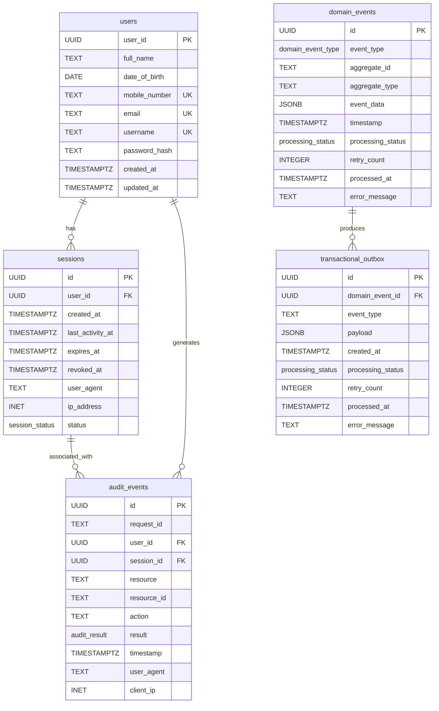

# Database Schema

This document outlines the database schema for the Artha Kosha Finance API.

## Entity-Relationship Diagram

## Enum Types

- `session_status`: `active`, `expired`, `revoked`
- `domain_event_type`: `UserRegistered`, `UserLoggedIn`, `UserLoggedOut`, etc.
- `processing_status`: `pending`, `processing`, `completed`, `failed`
- `audit_result`: `success`, `failure`
