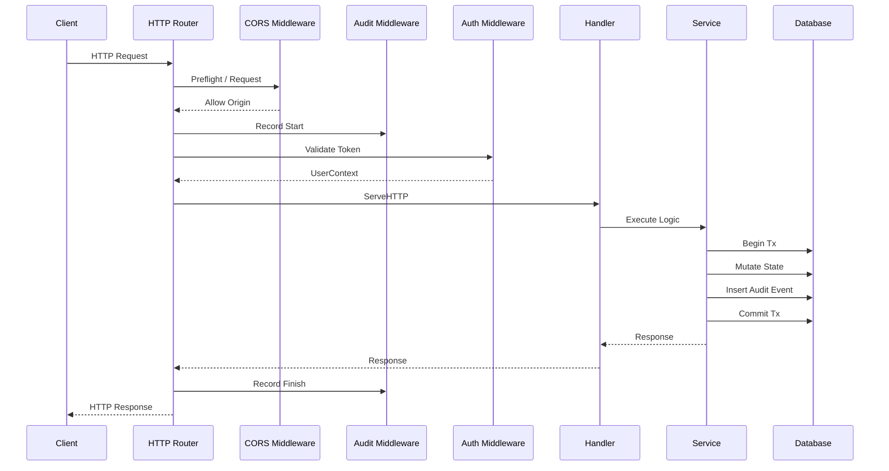

# Infrastructure Modernization Architecture

This document describes the updated architecture of the `artha-kosha` platform after implementing the infrastructure observability and transaction sessions features.

## Call Flow Diagram

## Middleware Chain
1. Request ID Injection
2. Structured Logging (slog)
3. Panic Recovery
4. CORS Handling
5. Timeout (30s)
6. Audit Logging
7. Authentication
