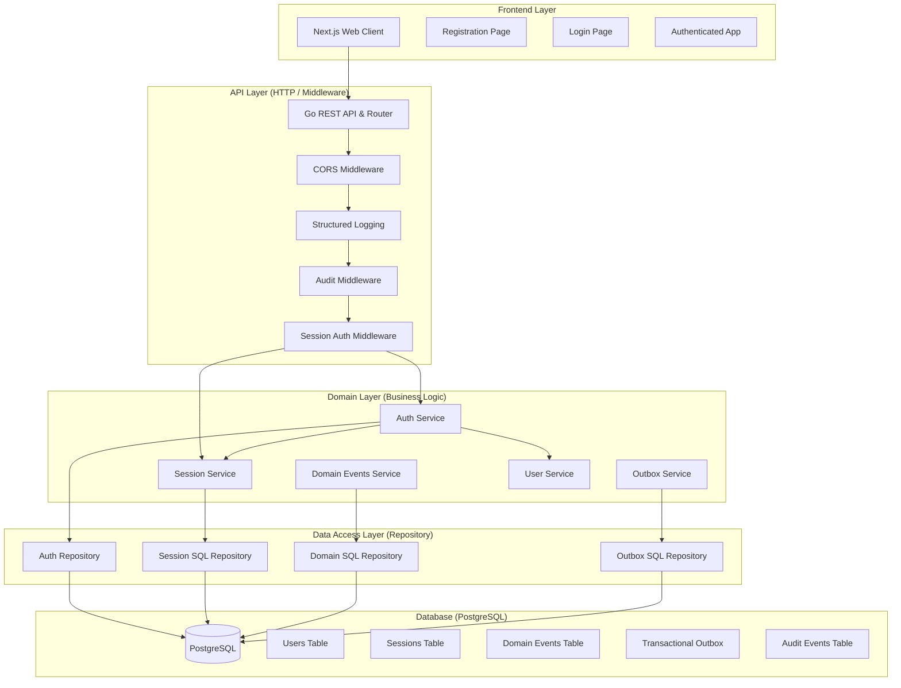
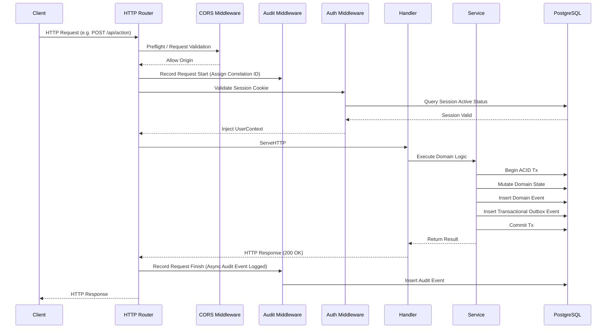
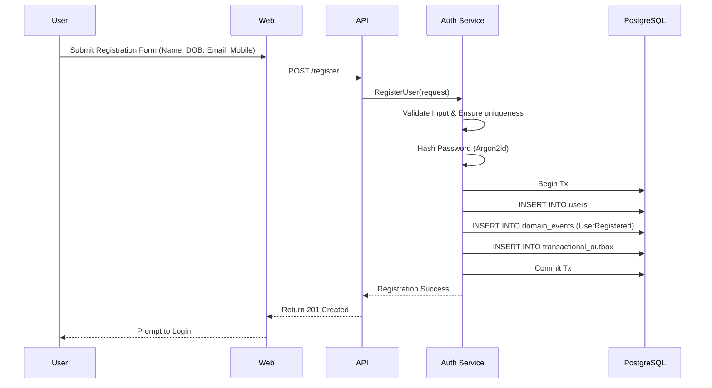
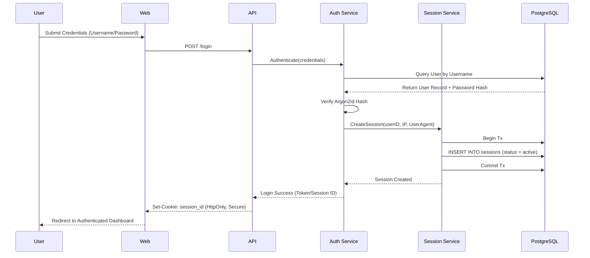
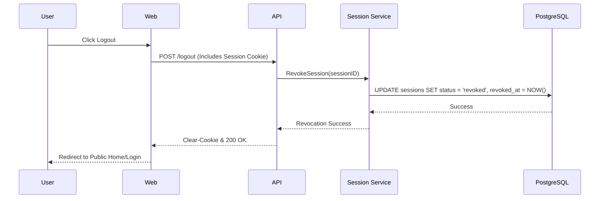

# ArthaKosha System Architecture

**Version**: 1.1.0  
**Status**: Active  

## Overview
This document represents the latest architecture, system design, and call flows of the ArthaKosha backend (`finance-api`). The application follows a Modular Monolith architecture, using Go, PostgreSQL, and follows strict adherence to ACID transactions and the Transactional Outbox pattern for domain events.

For database entity relationships, please refer to the [Database ER Diagram](database.md).

---

## 1. High-Level Component Architecture

---

## 2. API Call Flow (Middleware Chain & Domain Mutating Actions)

All authenticated and state-mutating requests go through a strict middleware chain that enforces observability, audit logging, and authorization, followed by an ACID database transaction.

---

## 3. User Flows

### A. User Registration Flow

### B. User Login & Session Creation

### C. Session Revocation (Logout)

---

## 4. Key Architectural Patterns Employed

1. **Transactional Outbox**: All domain events (e.g., `UserRegistered`, `PasswordChanged`) are saved to both a `domain_events` log and a `transactional_outbox` table within the **same database transaction** as the entity mutation. This guarantees that events are never lost and can be processed asynchronously by a background worker for notifications, webhooks, or syncing to external systems.
2. **Session-based Authentication**: Instead of stateless JWTs, sessions are stateful and persisted in the `sessions` table. This provides immediate revocation capabilities, concurrent session limits, and tight IP/Device tracking for security audits.
3. **Structured Audit Logging**: Operations produce immutable audit records linking `request_id`, `user_id`, `session_id`, `action`, and `result` (Success/Failure) to ensure 100% traceability for financial data security.
