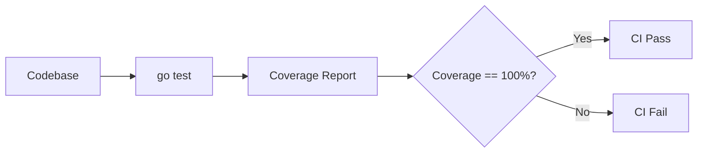
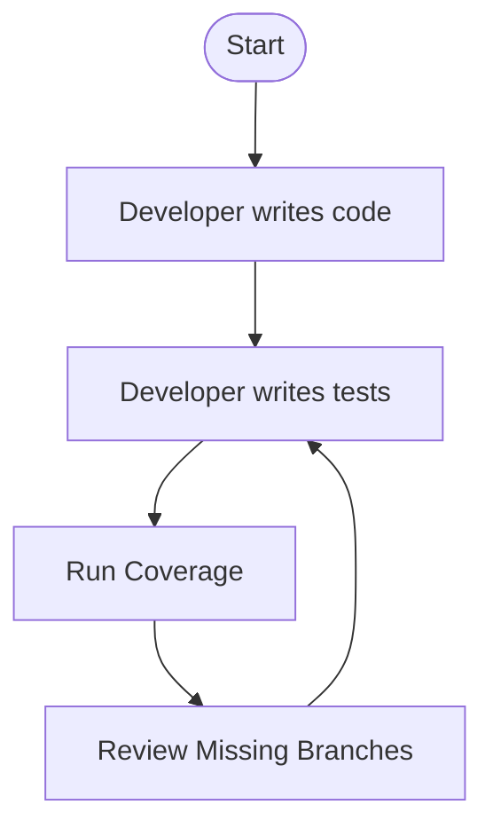
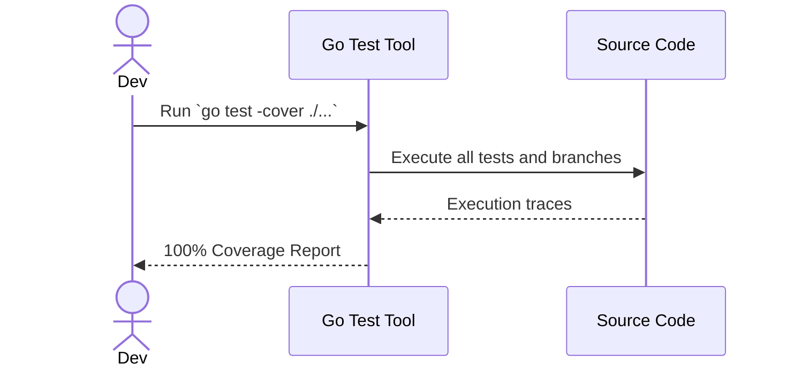

# Feature Specification: 100% Coverage and Infrastructure Documentation

**Feature Branch**: `[003-coverage-and-docs]`

**Created**: 2026-07-24

**Status**: Draft

**Input**: User description: "Hope all tests are running without any failures, and not skipped with TODO, also 100% code coverage is acheived. Update all docs, add ER diagram for database in docs, update constitution if required"

## User Scenarios & Testing *(mandatory)*

### User Story 1 - Resolve Skipped Tests (Priority: P1)

As a developer, I need all tests to execute without being skipped so that I can be confident that the session management and outbox atomicity functionalities are fully validated against regressions.

**Why this priority**: Skipped tests mask untested and potentially broken code paths.
**Independent Test**: Run `go test ./...` and ensure there are exactly 0 skipped tests across the `finance-api`.

**Acceptance Scenarios**:
1. **Given** the test suite executes, **When** all tests complete, **Then** no tests report a "SKIP" status.

---

### User Story 2 - Achieve 100% Statement Coverage (Priority: P1)

As a technical lead, I require 100% code coverage across the `finance-api` to ensure that every logical branch, error handler, and configuration path is exercised by our test suite.

**Why this priority**: Ensures comprehensive testing and reliability of the application layer.
**Independent Test**: Can be independently tested by running `go test -cover ./...` and checking that each package reports `100.0% of statements`.

**Acceptance Scenarios**:
1. **Given** the backend codebase, **When** coverage metrics are gathered, **Then** all Go packages report exactly 100% statement coverage.

---

### User Story 3 - Document Database ER Diagram (Priority: P2)

As an engineer onboarding to the project, I want to see an Entity-Relationship (ER) diagram in the documentation so that I understand the database architecture (tables: users, sessions, domain_events, transactional_outbox, audit_events, accounts, transactions, budgets).

**Why this priority**: Documentation prevents knowledge silos.
**Independent Test**: Render the markdown documentation to verify the Mermaid ER diagram displays correctly.

**Acceptance Scenarios**:
1. **Given** the infrastructure architecture docs, **When** reviewing the database section, **Then** a visual Mermaid ER diagram clearly outlines all tables and their relationships.

---

### User Story 4 - Update Constitution (Priority: P2)

As a project maintainer, I want to add 100% code coverage as a mandatory principle in the constitution so that all future feature work adheres to this standard.

**Why this priority**: Prevents future test coverage regressions.
**Independent Test**: Check `.specify/memory/constitution.md` for the new testing principle.

**Acceptance Scenarios**:
1. **Given** the project constitution, **When** new developers read the testing standards, **Then** they are explicitly instructed to maintain 100% test coverage.

### Edge Cases

- How does the system handle test coverage on auto-generated files (e.g. `sqlc` models and SQL repositories)? It must achieve 100% on them by testing repository boundaries.
- How are integration tests affecting coverage? Integration tests run with a real or mocked DB provide coverage metrics when combined with unit tests.

## Requirements *(mandatory)*

### Functional Requirements

- **FR-001**: System MUST resolve all 13 currently skipped tests, implementing their intended validation logic (e.g., session expiration, concurrent login, outbox atomicity).
- **FR-002**: System MUST achieve 100% Go statement coverage for all packages in `apps/finance-api`.
- **FR-003**: System MUST update `docs/infrastructure-modernization-architecture.md` (or equivalent architecture documentation) with a Mermaid-based ER diagram of the current Postgres schema.
- **FR-004**: System MUST append a new principle to `.specify/memory/constitution.md` mandating 100% code coverage.

### Session Management Requirements *(mandatory for authentication features)*
- **FR-XXX**: System MUST validate session status on every authenticated request (Tested via T025-T032).
- **FR-XXX**: System MUST support session revocation (single device and all devices) (Tested via T027, T030).

### Observability and Audit Logging Requirements *(mandatory for all features)*
- **FR-XXX**: System MUST generate immutable audit events for every successful business operation.

### Key Entities *(include if feature involves data)*
- **Database Schema**: Encompasses users, sessions, audit_events, domain_events, transactional_outbox, accounts, transactions, and budgets.

## System Design & Flow Documentation *(mandatory)*

### Architecture Diagram

### User Flow Diagram

### Call Flow Diagram

## Success Criteria *(mandatory)*

### Measurable Outcomes

- **SC-001**: Running `go test ./...` in the `apps/finance-api` outputs 0 skipped tests.
- **SC-002**: Running `go test -cover ./...` in the `apps/finance-api` outputs 100.0% coverage for every package.
- **SC-003**: ER Diagram is embedded in the main architecture documentation using valid Mermaid syntax.
- **SC-004**: Constitution explicitly mandates 100% test coverage.

## Assumptions

- Auto-generated code (like `sqlc`) is included in the 100% coverage target, and we will write repository tests to cover it.
- Integration tests will be written using a mock database (`go-sqlmock`) to achieve 100% coverage on DB failure edge cases.
