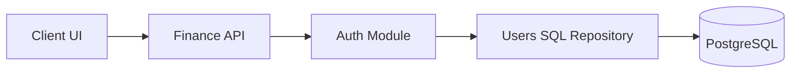
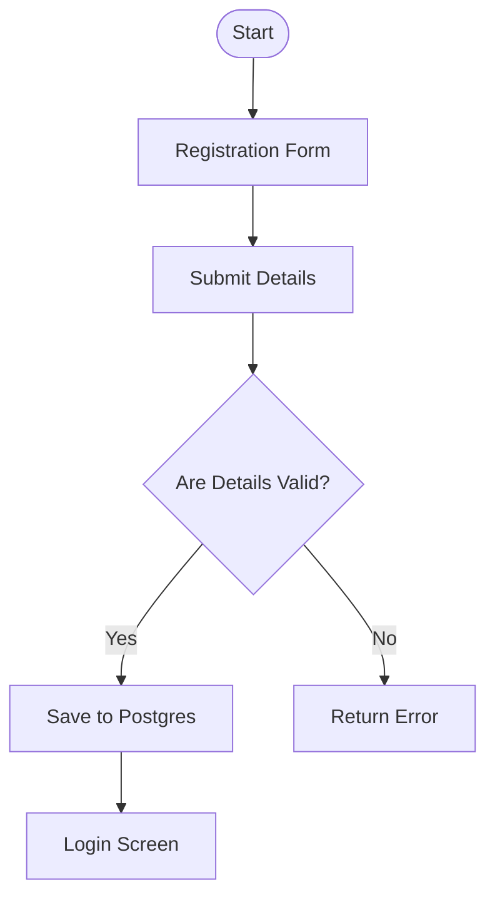
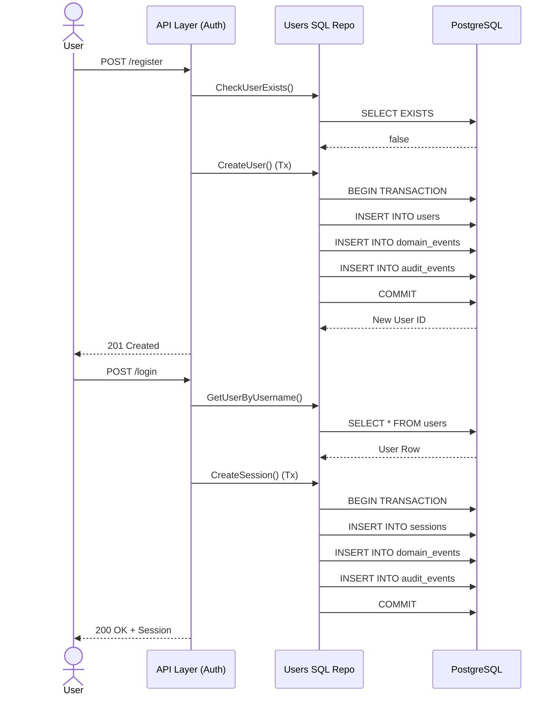

# Feature Specification: Connect Auth System to PostgreSQL Users Table

**Feature Branch**: `004-connect-auth-postgres`

**Created**: 2026-07-24

**Status**: Draft

**Input**: User description: "Connect Auth System to PostgreSQL Users Table..."

## Clarifications

### Session 2026-07-24
- Q: Session Data Retention → A: Retain session data with a configurable cleanup period (default 30 days).
- Q: Audit & Domain Events Integration → A: Strict Mode: Fail and rollback the operation if writing to audit or domain events fails.

## User Scenarios & Testing *(mandatory)*

### User Story 1 - Persist Registered Users (Priority: P1)

As a new user, I want my registration details to be safely stored in the database so that my account persists across application restarts.

**Why this priority**: Without this, all registered users are lost when the server restarts, making the system unusable in production.

**Independent Test**: Can be fully tested by registering a new account, restarting the API server, and successfully logging in with the newly created account.

**Acceptance Scenarios**:

1. **Given** the application is running, **When** a user registers with valid details, **Then** the user's data is persisted in the PostgreSQL `users` table.
2. **Given** a user has previously registered, **When** the application server restarts and the user attempts to log in, **Then** the login is successful.

---

### User Story 2 - Prevent Duplicate Accounts across Restarts (Priority: P2)

As the system, I need to ensure usernames and emails remain unique across the entire user base, even if the application restarts.

**Why this priority**: An in-memory map fails to enforce uniqueness constraints against historical data, leading to duplicate accounts.

**Independent Test**: Can be tested by registering, restarting the API, and attempting to register with the same username/email.

**Acceptance Scenarios**:

1. **Given** a user registered before an application restart, **When** a new registration attempts to use the same email or username, **Then** the registration is rejected with a duplicate error.

## Requirements *(mandatory)*

### Functional Requirements

- **FR-001**: System MUST persist newly registered users in the PostgreSQL `users` table.
- **FR-002**: System MUST retrieve user credentials and profiles from the PostgreSQL `users` table during login.
- **FR-002b**: System MUST return a 503 Service Unavailable error if the PostgreSQL database is unreachable during login or registration.
- **FR-003**: System MUST enforce uniqueness constraints for usernames, emails, and mobile numbers against the PostgreSQL database, rather than an in-memory map.
- **FR-003b**: System MUST gracefully handle PostgreSQL unique constraint violations and return an appropriate 409 Conflict error for duplicate registrations.
- **FR-004**: System MUST transition seamlessly from using the in-memory map to using the SQL database without altering the API response payload.
- **FR-004b**: System MUST execute user registration within a single database transaction encompassing the `users`, `domain_events`, and `audit_events` tables. Any failure in insertion MUST immediately rollback the entire transaction.
- **FR-004c**: System MUST execute user login within a single database transaction encompassing the `sessions`, `domain_events`, and `audit_events` tables. Any failure in insertion MUST immediately rollback the entire transaction.
- **FR-004d**: System MUST use Argon2id for secure password hashing during user registration.

### Session Management Requirements *(mandatory for authentication features)*

- **FR-005**: System MUST use HttpOnly cookies for web client session management
- **FR-006**: System MUST NOT store authentication state in browser localStorage
- **FR-007**: System MUST implement sliding session expiration with a configurable inactivity timeout (default 60 minutes) and absolute maximum lifetime (default 7 days).
- **FR-008**: System MUST validate session status on every authenticated request
- **FR-009**: System MUST support session revocation (single device and all devices)
- **FR-009b**: System MUST implement a configurable background cleanup process running every 24 hours to physically delete expired sessions (defaulting to 30 days retention post-expiry).

### Observability and Audit Logging Requirements *(mandatory for all features)*

- **FR-010**: System MUST implement structured logging with consistent log levels and formats
- **FR-011**: System MUST include timestamp, level, service, component, operation, request ID, correlation ID, user ID, session ID, duration, and message in every log entry
- **FR-012**: System MUST assign unique request IDs and correlation IDs to every request
- **FR-013**: System MUST generate immutable audit events for every successful business operation
- **FR-014**: System MUST NEVER log passwords, tokens, secrets, hashes, or vault values

### Key Entities *(include if feature involves data)*

- **User**: Represents an account in the system (stored in the `users` table). Key attributes include ID, Username, Email, PasswordHash, and CreatedAt.

## System Design & Flow Documentation *(mandatory)*

### Architecture Diagram

### User Flow Diagram

### Call Flow Diagram

### Documentation Finalization Rule

- The final architecture and supporting design notes MUST be written to the `docs/` directory only after the feature implementation has stabilized.
- The feature specification MUST show the exact user flow and call flow for the feature using Mermaid diagrams, not just prose describing the intent.

## Success Criteria *(mandatory)*

### Measurable Outcomes

- **SC-001**: 100% of newly registered users are visible in the `users` PostgreSQL table immediately after registration.
- **SC-002**: Users can successfully log in after the `finance-api` process restarts, proving data persistence.
- **SC-003**: API response times for registration and login do not exceed 500ms on average when interacting with the database.

## Assumptions

- The PostgreSQL database is already provisioned and accessible via the `DATABASE_URL` environment variable.
- The `sqlc` generated queries in `internal/sqlc/users.sql.go` correctly map to the existing database schema.
