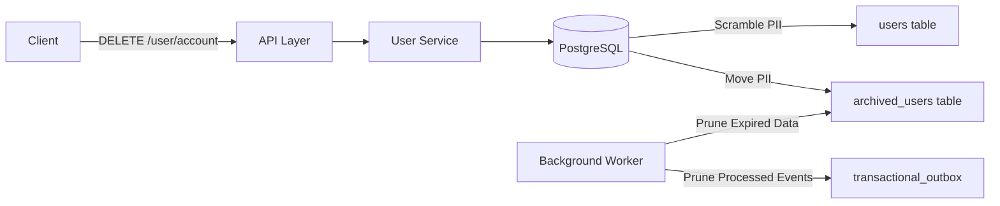
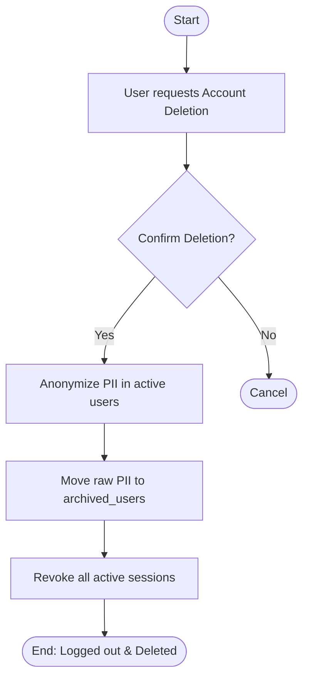
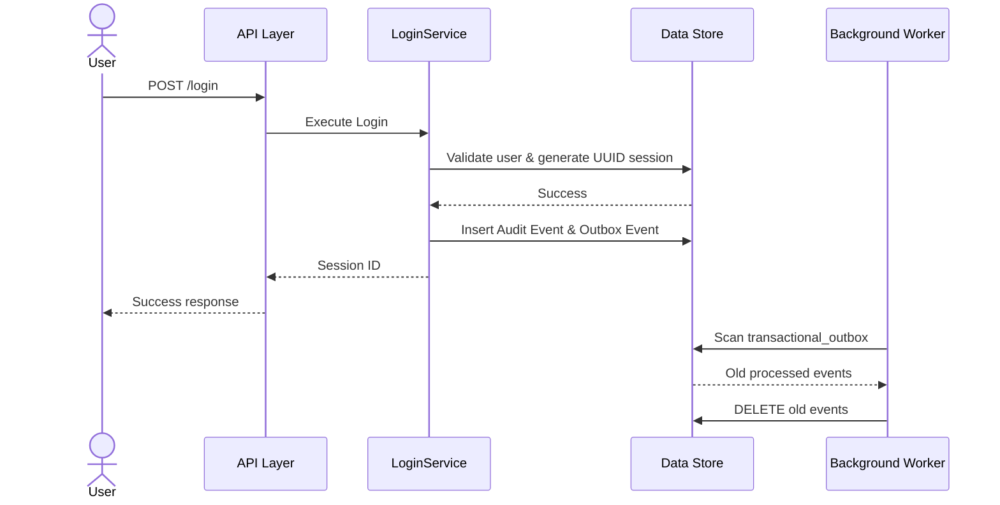

# Feature Specification: auth-outbox-gdpr

**Feature Branch**: `[005-auth-outbox-gdpr]`

**Created**: 2026-07-25

**Status**: Draft

**Input**: User description: "# Auth, Outbox, and GDPR Implementation Plan..."

## Clarifications

### Session 2026-07-25
- Q: Where and how should the "Delete Account" option be presented in the UI to the logged-in user? → A: Option A - Profile/Settings "Danger Zone", with an additional requirement that the user must type "DELETE" to confirm before the destructive action is executed.

## User Scenarios & Testing *(mandatory)*

### User Story 1 - Secure Session Resumption (Priority: P1)

As a user, I want to be able to log in multiple times without encountering internal server errors due to invalid session IDs, so that I have a reliable authentication experience.

**Why this priority**: Essential for basic application usage and user retention.

**Independent Test**: Can be fully tested by registering an account, logging out, and logging in again.

**Acceptance Scenarios**:

1. **Given** a user has previously registered and logged out, **When** they attempt to log in again with correct credentials, **Then** the login succeeds and they receive a valid session.
2. **Given** a successful login on the Postgres flow, **When** a new session is generated, **Then** the session ID is a valid standard UUID and avoids primary key collisions.

---

### User Story 2 - Accurate Audit and Event Tracking (Priority: P2)

As a system administrator, I want login, logout, and registration actions to emit domain events and be logged securely in the transactional outbox, so that all access logs are fully auditable and observable.

**Why this priority**: Essential for system observability and compliance with the constitution.

**Independent Test**: Can be tested by performing auth operations and querying the `audit_events`, `domain_events`, and `transactional_outbox` tables.

**Acceptance Scenarios**:

1. **Given** a user logs out via the `/logout` endpoint, **When** the operation completes, **Then** an audit event and a `USER_LOGGED_OUT` domain event are correctly recorded in the database.
2. **Given** a user registers, **When** the `USER_REGISTERED` domain event is created, **Then** a corresponding entry is also created in the `transactional_outbox` table within the same transaction.

---

### User Story 3 - GDPR Data Archiving & Deletion (Priority: P1)

As a privacy-conscious user, I want to completely delete my account, so that my personal data is scrubbed from the active operational tables in compliance with GDPR.

**Why this priority**: Required for legal and regulatory privacy compliance.

**Independent Test**: Can be tested by executing an account deletion request and inspecting both the `users` and `archived_users` tables.

**Acceptance Scenarios**:

1. **Given** an active user requests account deletion, **When** the deletion is processed, **Then** their PII (Email, Name, Mobile, DOB) is scrambled/anonymized in the main `users` table and their `deleted_at` flag is set.
2. **Given** an account deletion request, **When** the deletion is processed, **Then** their original unscrubbed PII is copied to an `archived_users` table with a retention expiration date.
3. **Given** an account deletion request, **When** the deletion is processed, **Then** all active sessions for the user are immediately revoked.

---

### User Story 4 - Background Data Lifecycle Management (Priority: P3)

As a system administrator, I want the system to automatically clean up old, processed outbox events and expired archived user data, so that the database does not grow indefinitely.

**Why this priority**: Necessary for long-term database performance and storage management.

**Independent Test**: Can be tested by manually inserting old/expired records into the `transactional_outbox` and `archived_users` tables and observing the background worker delete them.

**Acceptance Scenarios**:

1. **Given** the outbox background worker runs, **When** it finds `processed` outbox entries older than the configured retention days (default 7), **Then** it permanently deletes them from the table.
2. **Given** the archive background worker runs, **When** it finds entries in `archived_users` where the current time is past `retention_expires_at`, **Then** it permanently deletes them from the table.

## Requirements *(mandatory)*

### Functional Requirements

- **FR-001**: System MUST correctly generate a UUID for user sessions on login to avoid Postgres primary key errors.
- **FR-002**: System MUST intercept all login and logout requests via the `LoginService` to guarantee domain and audit event emission.
- **FR-003**: System MUST insert domain events into the `transactional_outbox` simultaneously when they are generated during user registration and login.
- **FR-004**: System MUST periodically delete successfully processed outbox events older than a configurable number of days (default 7).
- **FR-005**: System MUST expose a `DELETE /user/account` endpoint to process GDPR soft-deletion requests.
- **FR-006**: Client UI MUST present the account deletion option in a dedicated "Danger Zone" within the Profile or Settings page.
- **FR-007**: Client UI MUST prompt the user to manually type a confirmation keyword (e.g., "DELETE") before finalizing the account deletion request.
- **FR-008**: System MUST anonymize PII in the active `users` table while retaining the primary keys and financial relationships.
- **FR-009**: System MUST move the original PII to an `archived_users` table with an expiration timestamp based on a configurable retention period (default 30 days).
- **FR-010**: System MUST periodically scan the `archived_users` table and permanently drop records that have exceeded their retention period.

### Session Management Requirements *(mandatory for authentication features)*

- **FR-011**: System MUST use HttpOnly cookies for web client session management.
- **FR-012**: System MUST NOT store authentication state in browser localStorage.
- **FR-013**: System MUST implement sliding session expiration with configurable timeout.
- **FR-014**: System MUST validate session status on every authenticated request.
- **FR-015**: System MUST support session revocation (single device and all devices) specifically when an account deletion is initiated.

### Observability and Audit Logging Requirements *(mandatory for all features)*

- **FR-016**: System MUST implement structured logging with consistent log levels and formats.
- **FR-017**: System MUST include timestamp, level, service, component, operation, request ID, correlation ID, user ID, session ID, duration, and message in every log entry.
- **FR-018**: System MUST assign unique request IDs and correlation IDs to every request.
- **FR-019**: System MUST generate immutable audit events for successful login, logout, and account deletion operations.
- **FR-020**: System MUST NEVER log passwords, tokens, secrets, hashes, or vault values.

### Testing Requirements
- **FR-021**: Code coverage MUST reach 100% across all backend packages, including `cmd/main.go`.

### Key Entities *(include if feature involves data)*

- **User**: The active user record in the operational database (PII will be scrambled upon deletion).
- **ArchivedUser**: A new entity representing a soft-deleted user's raw PII securely stored until the retention period expires.
- **TransactionalOutbox**: The event queue table used for dispatching domain events asynchronously.
- **Session**: The user's active session, which must be uniquely identified by a proper UUID.

## System Design & Flow Documentation *(mandatory)*

### Architecture Diagram

### User Flow Diagram

### Call Flow Diagram

### Documentation Finalization Rule

- The final architecture and supporting design notes MUST be written to the `docs/` directory only after the feature implementation has stabilized.
- The feature specification MUST show the exact user flow and call flow for the feature using Mermaid diagrams, not just prose describing the intent.

## Success Criteria *(mandatory)*

### Measurable Outcomes

- **SC-001**: Users can repeatedly log out and log in without encountering 500 Server Errors due to invalid UUID parsing.
- **SC-002**: 100% of user logins and logouts explicitly record an Audit Event and a Domain Event.
- **SC-003**: The `transactional_outbox` table does not contain any `processed` records older than the configured retention threshold (default 7 days).
- **SC-004**: Users invoking the deletion endpoint have their active `users` row anonymized, and their original PII moved to `archived_users`.
- **SC-005**: The `archived_users` table does not contain any records older than the configured retention threshold (default 30 days).

## Assumptions

- Environment configuration can be easily modified to inject `OUTBOX_RETENTION_DAYS` and `ARCHIVE_RETENTION_DAYS`.
- The Next.js frontend will be responsible for providing the UI to trigger the `DELETE /user/account` endpoint.
- Background workers can be launched safely in the `cmd/main.go` initialization block without disrupting the web server startup.
